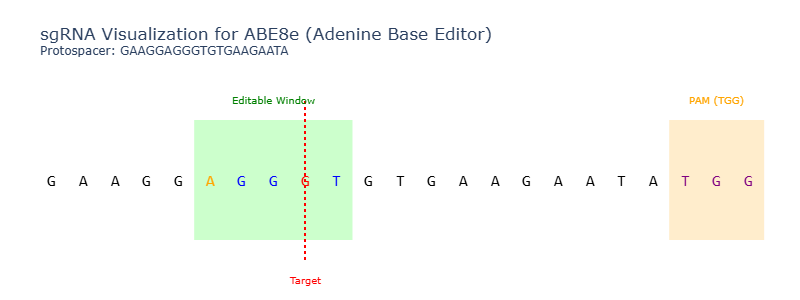

# 🧬 Base Editor Design Assistant

A Python tool to help researchers design efficient and precise **CRISPR base-editing** experiments, supporting cytosine and adenine base editors such as BE4max and ABE8e.

## What does this project do?

This tool assists in designing single-guide RNAs (sgRNAs) for **base-editing applications** (C→T or A→G conversions), ensuring that the target base falls within the editable window of a selected base editor.

The tool:
- Identifies compatible sgRNAs near your target base change.
- Evaluates compatibility with common base editors.
- Scores and ranks sgRNAs by on-target efficiency and predicted off-targets.
- Highlights potential **bystander edits** and PAM-blocking mutations.
- Provides **visual output** of editing windows and target base positions.

This is ideal for researchers aiming to:
- Correct point mutations
- Model human SNPs in cell lines or model organisms
- Introduce silent edits or stop codons using precise editing

---

## 📥 Input and 📤 Output

### Input:
- Genomic DNA sequence (FASTA, GenBank, or plain text)
- Desired edit (e.g., `C123T`)
- Base editor type (e.g., `BE4max`, `ABE8e`)
- PAM constraint (default: `NGG`)

### Output:
- List of candidate sgRNAs with:
  - Editable window alignment
  - Predicted on-target efficiency.
    **Currently based on a very simple GC content calculation, future improvements could integrate models like Doench '16, Azimuth, or deep learning models**
  - Off-target warning
  - Bystander editing flags
- Visualizations (PDF/HTML):
  - Editable windows and base alignment
    
- Summary statistics:
  - GC content
  - Guide rankings
  - Off-target summary (optional)

---

## ⚙️ Technical details

- **Language**: Python 3.8+
- **Libraries used**:
  - `Biopython` for sequence handling
  - `pandas` for data processing
  - `Plotly` or `Matplotlib` for plotting
  - (Optional) `CRISPRitz`/`Cas-OFFinder` integration for off-targets

- Modular design: base editor specs, scoring functions, and visualization logic are separated for extensibility.

---

## 💻 How to install and run

### 1. Clone the repository
```bash
git clone https://github.com/yourusername/Base-Editor-Design-Assistant.git
cd Base-Editor-Design-Assistant
```

### 2. Install dependencies
```bash
pip install -r requirements.txt
```
### 3. Run the tool
```bash
python base_editor.py --input example\sequence.fasta --edit A2821G --editor ABE8e --pam NGG --output results
```
---


## Editors supported
| Name      | Edit type | Editable window | PAM |
| --------- | --------- | --------------- | --- |
| BE4max    | C→T       | positions 4–8   | NGG |
| ABE8e     | A→G       | positions 4–7   | NGG |

*Future version could support more editors.

---

This project was written as part of the [WIS Python Course – March 2025](https://github.com/code-Maven/wis-python-course-2025-03).
